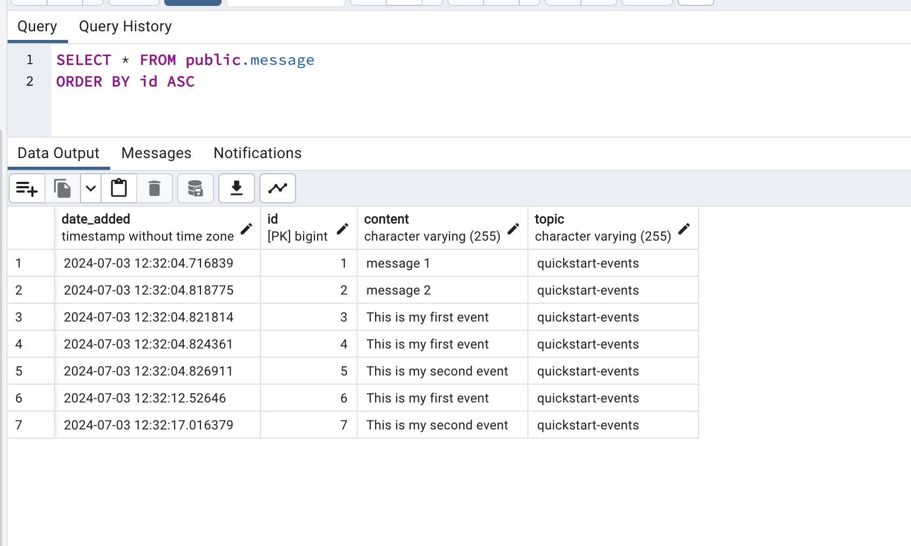

# Technical Interview for Polixis

This project is a Spring Boot application that consumes JSON messages from a Kafka topic, stores them in a PostgreSQL database, and includes unit tests for the Kafka consumer service.

### Step 1: Clone the Repository
Clone the repository from github onto your local system.


### Step 2: Start Database

I created database `polixis_interview` locally using postgres service. I am using pgAdmin throughout this demonstration as a visual tool for creating the database and viewing the data but the same task could be accomplished via terminal SQL commands.

### Step 3: Start Kafka

Based on Kafka quickstart tutorial linked [here](https://kafka.apache.org/quickstart). I downloaded and set up kafka locally. The local server and rest of kafka configuration can be found on [application.yaml](src%2Fmain%2Fresources%2Fapplication.yaml) file.
In particular the following commands are set in separate terminals to set up kafka locally.

Run the following commands in order to start all services in the correct order via zookeeper:

```
bin/zookeeper-server-start.sh config/zookeeper.properties

bin/kafka-server-start.sh config/server.properties
```
I then created a sample topic `quickstart-events` using the command below:
```
bin/kafka-topics.sh --create --topic quickstart-events --bootstrap-server localhost:9092
```
In a separate terminal tab I run the following command to add events to the `quickstart-events` topic.
```
bin/kafka-console-producer.sh --topic quickstart-events --bootstrap-server localhost:9092
```
Step 4: Run the Application
```
mvn spring-boot:run
```

In kafka event terminal tab each line you enter will result in a separate event being written to the topic.
```
This is my first event

This is my second event
```
By opening the database you can see the table `message` contains new entries based on the entered events.



## Run Tests
There is a singular unit test [KafkaConsumerServiceTest.java](src%2Ftest%2Fjava%2FKafkaConsumerServiceTest.java) that checks the content and validity of adding a test message and checking the repository in the database to see the row has been added. You can run the test by running the command below.
```
mvn test
```
